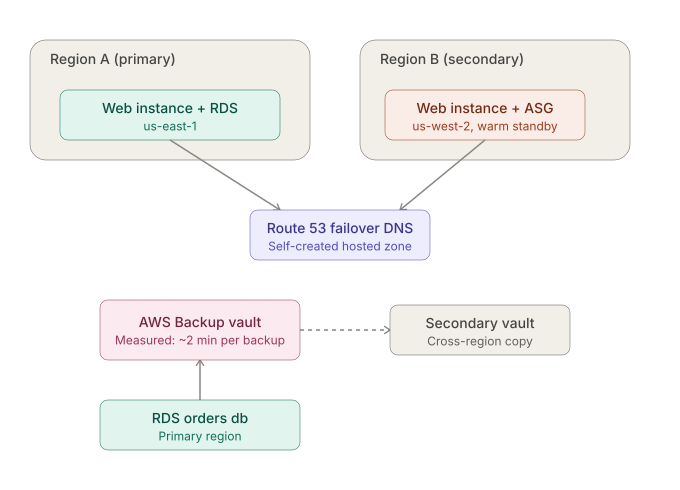

# aws-multi-region-dr

Multi-region disaster recovery on AWS — Warm Standby architecture with AWS Backup cross-region replication and Route 53 automatic failover, tested against a 30-min RTO / 5-min RPO target.

> **Status:**  Deployed and tested live on AWS (us-east-1 / us-west-2). Measured failover: **~2 minutes** against a 30-minute target. Full breakdown, including two real issues hit and fixed during the restore drill, in [`docs/RESULTS.md`](docs/RESULTS.md).

## Why this project

Most tutorials stop at "here's how DR *could* work." This project actually **provisions the infrastructure, breaks it on purpose, and measures the real recovery time** against defined objectives — because an RTO/RPO on paper means nothing until you've watched the failover happen.

## Architecture


## Recovery objectives

| Objective | Target |
|---|---|
| RTO (Recovery Time Objective) | 30 minutes |
| RPO (Recovery Point Objective) | 5 minutes |

**Pattern chosen: Warm Standby.** A continuously replicated, scaled-down secondary environment meets a 30-minute RTO / 5-minute RPO more reliably than Backup & Restore, while costing less than full Active-Active. See `docs/DESIGN_DECISIONS.md` for the full reasoning and the alternatives considered.

## What this repo does

1. **Data protection** — AWS Backup vault (KMS-encrypted) with a daily backup plan and cross-region copy to a secondary vault, applied to resources by tag.
2. **DNS failover** — Route 53 health check on the primary endpoint with PRIMARY/SECONDARY failover routing records.
3. **Monitoring** — a CloudWatch alarm on the health check, an SNS topic for alerts, and a CloudWatch dashboard.
4. **Automated DR** — a Lambda function subscribed to that SNS topic scales the secondary region's Auto Scaling Group to full capacity the moment the alarm fires — the "warm standby → full capacity" step happens without a human running a command mid-incident.
5. **Failure simulation** — stop the primary instance and time how long DNS takes to fail over, and watch the automated response happen.
6. **Restore drill** — restore the database from the most recent recovery point and confirm data loss is within the RPO.

Everything above is provisioned as CloudFormation (`cloudformation/`), with the original CLI scripts (`scripts/`) kept for anyone who wants to see each AWS API call explicitly or run steps individually.

## Repo structure
`cloudformation/ IaC: bootstrap infra, backup vaults/plan, Route 53 failover, monitoring, automated DR
lambda/ Automated DR responder (Lambda) source
scripts/ AWS CLI scripts for each stage, plus deploy/teardown
docs/ Design decisions, operational runbook, and results write-up
architecture/ Diagram source + screenshots
.env.example Copy to .env and fill in your own account/region values`


Script order (no numeric prefixes — run in this sequence if using Option B below):
`create-backup-vault.sh` → `create-backup-plan.sh` → `assign-resources.sh` → `setup-route53-failover.sh` → `test-failover.sh` → `restore-from-backup.sh`. `deploy-cloudformation.sh` and `teardown.sh` are standalone (Option A).

See [`docs/RUNBOOK.md`](docs/RUNBOOK.md) for the step-by-step operational procedure, and [`architecture/diagram.md`](architecture/diagram.md) for the full diagram source.

## Before you deploy

This provisions real, billable AWS resources (small ones — see cost note below). You'll need:

1. **AWS CLI configured** with credentials that can create EC2, RDS, Backup, Route 53, CloudWatch, SNS, Lambda, and IAM resources.
2. **Your VPC and subnet IDs**, in both regions:
```bash
   aws ec2 describe-vpcs --region $PRIMARY_REGION --filters Name=isDefault,Values=true --query "Vpcs[0].VpcId"
   aws ec2 describe-subnets --region $PRIMARY_REGION --filters Name=vpc-id,Values=<vpc-id> --query "Subnets[].SubnetId"
```
   Repeat for `$SECONDARY_REGION`. Put the results in `.env`. (This project was deployed and tested against `us-east-1` / `us-west-2` — two genuinely different regions, which the DR pattern requires.)
3. **An S3 bucket you own**, for the Lambda deployment package (`LAMBDA_CODE_BUCKET` in `.env`).

**No domain required.** The Route 53 template creates its own hosted zone and you validate failover by querying its nameservers directly with `dig` — see `docs/RUNBOOK.md`.

**Approximate cost while running:** ~$0.02–0.05/hr for two t3.micro instances + one db.t3.micro RDS instance (often covered by AWS Free Tier on a new account), plus ~$1–1.50/month for the Route 53 hosted zone and health check. Nothing here uses customer-managed KMS keys, which would add ~$1/month/key. Tear down with `scripts/teardown.sh` when you're done testing.

## Running it

**Option A — CloudFormation (recommended):**

```bash
cp .env.example .env      # fill in VPC/subnet IDs, DB password, S3 bucket, etc.
chmod +x scripts/*.sh
./scripts/deploy-cloudformation.sh
```

This deploys, in order: bootstrap infrastructure (web instances + RDS) in both regions, the secondary backup vault, the primary backup vault/plan/selection, Route 53 failover, CloudWatch monitoring + SNS, and the automated DR Lambda — appending the IPs, instance ID, and ASG name it creates back into your `.env` automatically.

**Option B — CLI scripts, one step at a time:**

```bash
cp .env.example .env
chmod +x scripts/*.sh
./scripts/create-backup-vault.sh
./scripts/create-backup-plan.sh
./scripts/assign-resources.sh
./scripts/setup-route53-failover.sh
./scripts/test-failover.sh <nameserver>
./scripts/restore-from-backup.sh <recovery-point-arn>
```

Note: Option B still assumes the bootstrap resources (web instances, RDS) already exist — run the bootstrap stacks from Option A first, or adapt the scripts to your own existing infrastructure.

Requires the AWS CLI configured with credentials that have `AWSBackupFullAccess`, `AmazonRoute53FullAccess`, `CloudWatchFullAccess`, `AWSLambda_FullAccess`, and EC2/RDS/Auto Scaling permissions for the resources involved.

## Results

**Measured on a live deployment** (us-east-1 primary, us-west-2 secondary):

| Metric | Target | Measured |
|---|---|---|
| DNS failover time | ≤ 30 min | **~2 min** |
| Failback time | — | **< 2 min** once health check passed |
| Automated secondary scale-up | — | Confirmed (ASG desired capacity 1 → 4) |
| On-demand backup completion | — | ~2 min |
| RDS restore | — | Completed successfully |

Full numbers, methodology, and the RPO caveat are in [`docs/RESULTS.md`](docs/RESULTS.md).

## Issues encountered during deployment, and how they were fixed

This project was deployed and tested against a real AWS account, not just written and left untested — and it broke in a number of genuinely instructive ways along the way. Documented here in full rather than cleaned up, because working through real failures is the actual point of a DR drill.

### Configuration and environment setup

**Invalid AWS region name.** An early `.env` draft used `PRIMARY_REGION=eu-east-1`, which isn't a real AWS region. *Fix:* corrected to real regions (`us-east-1` / `us-west-2` in the final deployment). A second draft accidentally set both `PRIMARY_REGION` and `SECONDARY_REGION` to the same value (`us-east-1`) — a mistake that would have meant no actual regional redundancy. *Fix:* confirmed two genuinely different regions before deploying.

**Placeholder values never replaced.** The initial `.env` still contained templated placeholders — `KMS_KEY_ID=arn:aws:kms:...:key/xxxx-xxxx`, `PRIMARY_IP=1.2.3.4`, `HOSTED_ZONE_ID=Z0123456789ABCDEFGHIJ`, etc. — copied verbatim from the example file without being replaced with real values. *Fix:* the project was restructured so customer-managed KMS keys weren't needed at all (AWS Backup's default managed key is used instead, saving ~$1/month/key and removing that placeholder entirely), and a "bootstrap" CloudFormation stage was added to actually provision the VPC-dependent resources (EC2 instances, RDS) and have the deploy script capture their real IPs/IDs automatically rather than requiring them to be hand-entered.

**Missing baseline infrastructure.** The original CloudFormation only covered backup/DNS/monitoring — it assumed a web tier and database already existed, which they didn't ("starting from zero"). *Fix:* added `bootstrap-primary.yaml` (primary EC2 web instance + RDS database) and `bootstrap-secondary.yaml` (secondary EC2 DNS-target instance + warm-standby Auto Scaling Group), deployed first in the pipeline.

### Bash scripting bugs

**Apostrophe inside `${VAR:?error message}` breaks bash parsing.** A restore script used `${RESTORE_DB_SUBNET_GROUP:?...this script's header}` — the apostrophe in "script's" caused `bash -n` to fail with `unexpected EOF while looking for matching ''`, even though the whole expression was inside double quotes. This is a known bash quirk: single quotes inside the `:?` error-message portion of a parameter expansion are parsed specially regardless of outer quoting. *Fix:* reworded the message to avoid the apostrophe entirely ("the header of this script" instead of "this script's header"). Caught by running `bash -n` on every script before handing it over, rather than at the moment the person actually tried to run it.

### CloudFormation / deployment tooling

**Deploy script called with the wrong filename.** `./scripts/deploy-cloudformation.sh` was run when the file was actually saved as a differently-numbered name at the time. *Fix:* confirmed exact filenames with `ls` before troubleshooting further; later, numeric prefixes were dropped from every script and CloudFormation template entirely (by request) and the deploy script's internal `--template-file` references were updated to match — this was the root cause of several "Invalid template path" errors that recurred multiple times as files were renamed inconsistently between local copies.

**Stale/incomplete local file copies.** Across several re-extracts and manual edits, local copies of `cloudformation/bootstrap-secondary.yaml`, `cloudformation/monitoring.yaml`, and `cloudformation/route53-failover.yaml` fell out of sync with the actual current version multiple times — causing deploy failures like `Parameters: [HostedZoneId, PrimaryEndpoint] must have values` (an old version of `route53-failover.yaml` expecting parameters the current deploy script no longer passes) and `Parameters: [PrimaryIp, SecondaryIp] must have values` (a stale `monitoring.yaml` apparently mixed up with draft content from a different template). *Fix:* rather than continuing to patch files one at a time as each mismatch surfaced, did a full clean re-extract from a verified source and diffed against it going forward.

### AWS Backup / RDS restore

**Wrong metadata key name.** The restore script's `--metadata` JSON used `"TargetDBInstanceIdentifier"` to name the new restored instance. AWS Backup's actual RDS restore metadata key for this is `"DBInstanceIdentifier"` (identically named to, but distinct in meaning from, the *source* instance identifier used elsewhere) — genuinely confusing AWS naming. This produced the error `DBInstanceIdentifier must be specified`. *Fix:* corrected the key name in the restore script.

**Misleading job-failure status.** After fixing the key name, a second restore attempt returned `RDS DBInstanceAlreadyExists: DB instance already exists` and the AWS Backup job showed `Status: FAILED`. This looked like a hard failure, but checking the actual RDS resource directly (`aws rds describe-db-instances`) showed the instance was genuinely being created in the background (`DBInstanceStatus: creating`) — the underlying restore had actually kicked off successfully; only the Backup-side job record couldn't reconcile against an instance ID that (from an earlier partial attempt) already existed. *Fix:* switched to polling `aws rds describe-db-instances` directly rather than trusting the AWS Backup job status alone, which is the more reliable source of truth for the actual resource state.

**Placeholder DB subnet group.** The restore script originally hardcoded `"DBSubnetGroupName": "my-subnet-group"` — a non-existent placeholder. *Fix:* looked up the real, CloudFormation-auto-generated subnet group name via `describe-stack-resources`, and made the script require it as a configurable `.env` value (`RESTORE_DB_SUBNET_GROUP`) instead of a hardcoded guess.

**Wrong IAM role reference.** `IAM_BACKUP_ROLE_ARN` in `.env` pointed at `AWSBackupDefaultServiceRole` — a role that doesn't exist by default in a fresh AWS account (it's normally created interactively via the console, not automatically). The restore call failed with `IAM Role cannot be assumed by AWS Backup`. *Fix:* used the actual role CloudFormation had created (`dr-backup-primary-backup-role`) instead.

**Restore didn't preserve the original security posture.** The restored RDS instance ended up attached to the VPC's default security group (open, unrestricted) rather than the purpose-built, locked-down `DbSecurityGroup` the original instance used — because the restore metadata never specified `VpcSecurityGroupIds`. Caught while trying to validate the restored data and finding the connection unexpectedly blocked from the "wrong" security group. *Fix:* documented as a known gap (see README "Next steps") — a production version of this restore path should explicitly pass `VpcSecurityGroupIds` so restored instances don't silently regress to an open default.

### Networking / DNS

**`dig` not installed by default on Ubuntu.** *Fix:* `sudo apt install -y dnsutils`.

**MariaDB client doesn't support MySQL 8's `--ssl-mode` flag.** Ubuntu's default `mysql` command is frequently the MariaDB client build, which rejects `--ssl-mode=VERIFY_IDENTITY` with `unknown variable`. *Fix:* dropped the flag, kept `--ssl-ca` only, which both client variants support.

**RDS `--publicly-accessible` modification didn't take effect immediately, and silently no-op'd once.** A `modify-db-instance --publicly-accessible` call was issued, but a follow-up check showed the instance still reporting `PubliclyAccessible: false` with no pending changes — meaning the change had genuinely not been queued the first time (not just "still processing"). *Fix:* re-issued the modify call after confirming the required security-group rule was actually in place (see below), and verified with `DBInstanceStatus: modifying` immediately after the second call to confirm it had actually queued that time.

**Security-group rule silently missing on the first attempt.** An `authorize-security-group-ingress` command was intended to open port 3306 to the tester's IP but initially targeted the wrong security group entirely (a name-pattern match against `*DbSecurityGroup*` found the VPC's default security group instead of the one actually attached to the restored instance, since the restore had regressed to the default — see above). *Fix:* identified the correct, actually-attached security group ID directly from `describe-db-instances` output, then authorized the rule against that specific group.

**EC2 stop/start silently breaks DR wiring if there's no Elastic IP.** After the primary instance was intentionally stopped (for the failover test) and later restarted (for the failback test), AWS assigned it a brand-new public IP — standard EC2 behavior for an instance without an Elastic IP attached. Both the Route 53 health check and the PRIMARY DNS A record were still pointing at the *old* IP, so the health check kept failing (`Connection timed out`) even though the instance itself was healthy and reachable at its new address. This is a genuinely realistic production gotcha, not a lab-only artifact. *Fix:* updated the health check (`update-health-check --ip-address`) and the DNS record (`change-resource-record-sets` UPSERT) to the new IP. **Real fix for production**: attach an Elastic IP to the primary (or better, put it behind an ALB) so this can't happen on a routine restart — logged as a follow-up in "Next steps" below.


### What this list is for

None of these are exotic failures — a wrong parameter name, a misleading status field, an IP that changes on restart, a security group that doesn't get carried over on restore. They're exactly the class of issue a DR drill exists to surface before a real incident does, and each one here is documented with the actual command that revealed it and the actual fix, not a sanitized summary.

